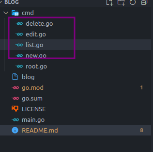

## 具体写一个例子, 设计一个命令叫blog， 有四个子命令

```bash
 blog new [post-name] ：创建一篇新的blog
 blog list   ：列出当前有哪些文章
 blog delete [post-name]: 删除某一篇文章
 blog edit [post-name]：编辑某一篇文章
```

计划有以下几个步骤

创建模块
用cobra的命令行，创建命令行入口
用cobra的命令行，创建子命令
编写功能逻辑

```bash
cobra-cli init -a chunk -l mit
```
## tree
```bash
./cmd
./cmd/root.go
./go.mod
./go.sum
./LICENSE
./main.go
```

## 创建子命令
新版本命令为cobra-cli，旧版本为cobra
```bash
cobra-cli add  new
cobra-cli add  list
cobra-cli add  delete
cobra-cli add  edit
```

cmd 目录下增加了 new.go, delete.go,list.go,edit.go



cobra 是一个高效的命令行解析库，利用cobra的脚手架，可以快速的实现一个命令行工具。如果需要更细致的控制，可以参考cobra的官方文档。